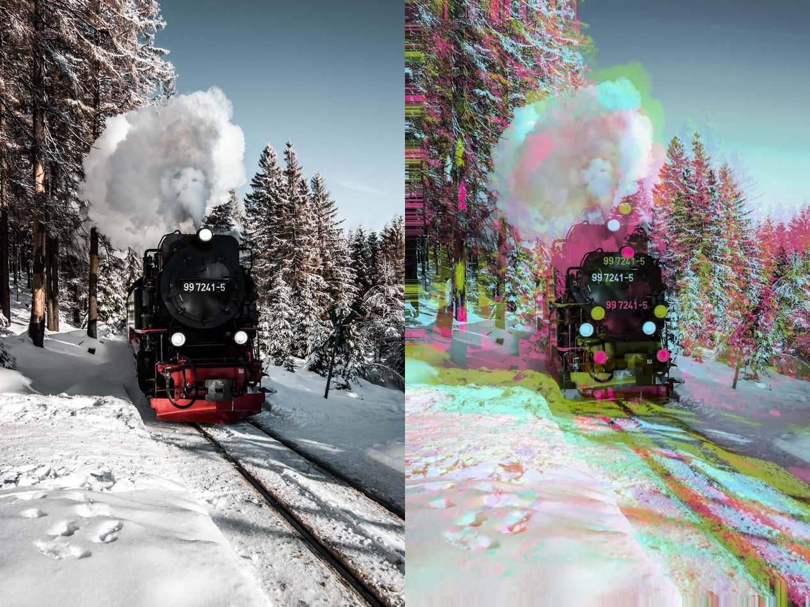

# tripmage

> A trippy image filter, depending on color space conversions.

This is based on a fun idea I had about color space re-assembly.



## Table of Contents

- [Usage](#usage)
- [Background](#background)
- [Performance](#performance)
- [TODOs](#todos)
- [NOTDOs](#notdos)
- [Contribute](#contribute)

## Usage

Simple example:

```
./src/tripmage.py /tmp/input.webp /tmp/output.png
```

Image type support is whatever your locally installed PIL provides.  Usually at least png, jpg, bmp, gif, webp.

Can be made completely deterministic:

```
./src/tripmage.py --options '{"seed": "hello, world"}' /tmp/input.webp /tmp/output.png
```

Full help / "documentation":

```
$ ./src/tripmage.py --help
usage: ./src/tripmage.py [-h] [--options OPTIONS] [-f] [-v] file_in file_out

Make an image very trippy.

positional arguments:
  file_in            Input file, must be readable
  file_out           Output file, must not exist

optional arguments:
  -h, --help         show this help message and exit
  --options OPTIONS  Options-dict in JSON
  -f, --force        Overwrite output file if exists
  -v, --verbose      Report actual options-dict in JSON
```

Automated creation of an "*intensifies*" gif:

```
for i in $(seq 0 30) ; do ./src/tripmage.py --options "{\"seed\":\"asdf $(($i))\", \"distortion\": {\"type\": \"static_random\", \"scale_type\": \"abs\", \"scale_x\": $(($i * 2)), \"scale_y\": $(($i * 2))}}" /tmp/input.webp /tmp/output_${i}.gif & done ; wait
ls /tmp/output_*.gif | sort -k1.13 -n | xargs gifsicle -d10 -l0 --colors 256 > /tmp/the_loop.gif
```

### Options

"Options" is an over-engineered beast with lots of control over the program.
Run with `--verbose` to see the full potential of it:

```
{
 "border": {
  "fn": "<function border_snap at 0x7fb2d53c4680>",
  "seed": "default border seed from 3831322704",
  "type": "snap"
 },
 "colorspace": {
  "col_to_rgb": "<function color_projgamma_col2rgb at 0x7fb2d53c4830>",
  "gamma": 2.4,
  "rgb_to_col": "<function color_projgamma_rgb2col at 0x7fb2d53c47a0>",
  "seed": "default colorspace seed from 3831322704",
  "type": "projected_gammacorrected"
 },
 "components": {
  "_cache": "[<Color [0.4033363538071116, -0.551564745672753, 0.7301343143754687] at 0x00007fb2d46639d0>, <Color [-0.8964017243246609, -0.07788870035673467, 0.4363453895534058] at 0x00007fb2d4663bd0>, <Color [-0.18380352098194183, -0.8304876168177886, -0.5258389335024088] at 0x00007fb2d4663850>]",
  "fn": "<function components_staticrandom at 0x7fb2d53c48c0>",
  "seed": "default components seed from 3831322704",
  "type": "static_random"
 },
 "distortion": "static_random",
 "distortion_1": {
  "_cache": "[-9.30099748194189, -4.983430340391781]",
  "fn": "<function distortion_staticrandom at 0x7fb2d53c4950>",
  "scale_type": "rel",
  "scale_x": 0.05,
  "scale_y": 0.05,
  "seed": "default distortion_1 seed from 3831322704",
  "type": "static_random"
 },
 "distortion_2": {
  "_cache": "[-11.892628207914214, 13.957191433380906]",
  "fn": "<function distortion_staticrandom at 0x7fb2d53c4950>",
  "scale_type": "rel",
  "scale_x": 0.05,
  "scale_y": 0.05,
  "seed": "default distortion_2 seed from 3831322704",
  "type": "static_random"
 },
 "distortion_3": {
  "_cache": "[21.6110884764867, -4.833552887061039]",
  "fn": "<function distortion_staticrandom at 0x7fb2d53c4950>",
  "scale_type": "rel",
  "scale_x": 0.05,
  "scale_y": 0.05,
  "seed": "default distortion_3 seed from 3831322704",
  "type": "static_random"
 },
 "interpolation": {
  "fn": "<function interpolate_nearest_neighbor at 0x7fb2d53c4710>",
  "seed": "default interpolation seed from 3831322704",
  "type": "nearest_neighbor"
 },
 "margins": {
  "bottom": 0,
  "left": 0,
  "right": 0,
  "top": 0
 },
 "seed": "3831322704"
}
```

As you can see, there's a lot that *can* be specified, and none of it is *required*.

The items `border`, `colorspace`, `components`, `distortion`, and `interpolation`
can also be given as a string known in the corresponding "registry".
Currently, these registries only contain a single choice each, but will be extended soonish.

The keys `"distortion_1"` etc. are special, in that you can also provide options only once for
`"distortion"`, and they will be automatically copied.

## Background

The inspiration came when I saw the usual effect of "image with RGB channels separated and shifted against each other slighty".

I thought to myself "Why always RGB?"
Well, because that's easy to implement.
But that's actually the only reason:
All you need is a 3-dimensional colorspace, and this operation is well-defined.
And with other, arbitrary color spaces, it looks way cooler!

Next is the shift itself: Why is it always just three independent, constant vectors?
Well, because that's easy to implement.
But that's actually the only reason:
All you need is a distortion function (i.e. 2d-to-2d, somewhat continuous,
ideally Lipschitz bounded because it would be too distorted otherwise).
And with arbitrarily wacky distortions, it looks way trippier!

## Performance

Not especially good.  However, I don't think it's actually worth the effort to rewrite it.

## TODOs

* More interesting component/distortion noise
* Nicer automation for animations
* Rewrite in Rust, maybe?

## NOTDOs

* Not sure yet
* Does this need an install option?  [File a bug](https://github.com/BenWiederhake/tripmage/issues/new) if you think so.

## Contribute

Feel free to dive in! [Open an issue](https://github.com/BenWiederhake/tripmage/issues/new) or submit PRs.
